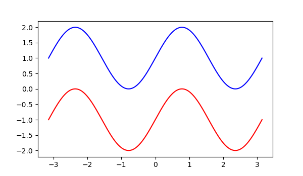

```{r setup, include=FALSE}
library(knitr)
library(reticulate)
knitr::opts_chunk$set(echo = FALSE)
knitr::knit_engines$set(python = reticulate::eng_python)
```

# Introduction

Within all areas of science, the reproducibility crisis is rampant [@reproducibility]. As data scientists, it it vital that we ensure all of our findings are reproducible; R Markdown provides a great way of achieving this.

If you are already using R Studio within your workplace, then you already have the ability to start creating some amazing reproducible documents!

# Integrate R Code & More

The main feature of R Markdown is the ability to integrate your R code outputs into the document; every time you render, or 'knit', the document using Knitr the output script is re-run, which means you don't have to keep copying and pasting images into your static Word document whenever you change the code or data behind it. Here's an example:

```{r rplot, echo = TRUE, warning = FALSE, out.width='80%', fig.align='center', fig.cap='Example R Plot', fig.height=5}
library(ggplot2)
options(scipen=999)  # turn-off scientific notation like 1e+48
theme_set(theme_bw())  # pre-set the bw theme.
data("midwest", package = "ggplot2")

# Scatterplot
ggplot(midwest, aes(x=area, y=poptotal)) + 
  geom_point(aes(col=state, size=popdensity)) + 
  geom_smooth(method="loess", se=F) + 
  xlim(c(0, 0.1)) + 
  ylim(c(0, 500000)) + 
  labs(subtitle="Area Vs Population", 
       y="Population", 
       x="Area", 
       title="Scatterplot", 
       caption = "Source: midwest")
```

Of course, you don't have to print the code with the output if you don't want to!

You can also use LaTeX within your documents to write out formulas, such as $E=mc^2$, plus it can render the output of other programming languages too! Here's a graph produced with Python's Matplotlib library:

```{python, eval=FALSE}
# Unfortuntely, the reticulate library isn't as easy as I make it sound. To get around it not working with Knitr, I've saved the plot to file within RStudio then inserted the image when the document get knitted.
import numpy as np
import matplotlib.pyplot as plt

n = 256
X = np.linspace(-np.pi,np.pi,n,endpoint=True)
Y = np.sin(2*X)

fig = plt.figure(figsize=(6, 3.5))

plt.plot (X, Y+1, color='blue', alpha=1.00)
plt.plot (X, Y-1, color='red', alpha=1.00)
plt.savefig("pyfig.png")
```

```{r, out.width='80%', fig.align='center', fig.cap='Example Python Plot'}

```


Want to manipulate data created using Python with R? No worries, the reticulate package even allows for communication between the two! [@reticulate]

# Output Formats

But what exactly does a document created using R Markdown look like? Well, the options are endless! Here's a few common examples (both static & dynamic) of what you can create:

* PDFs
* Books
* Microsoft PowerPoint
* Dashboards - akin to Business Intelligence Software but with far more customisation abilities)
* Posters - infact, this poster was created using R Markdown and the posterdown package [@R-posterdown]

```{r, out.width='80%', fig.align='center', fig.cap='An interactive dashboard created using R Markdown and Shiny'}
knitr::include_graphics("https://d33wubrfki0l68.cloudfront.net/af522791fe4f4ec3df715910a192fcc9ab0af296/d152b/galleryimages/dashboard1.png")
```

# Cheat Sheet

As with all great R packages, there is a cheat sheet available! This one and many more can be found at https://rstudio.com/resources/cheatsheets/.

```{r, out.width='80%', fig.align='center', fig.cap='The R Markdown Cheat Sheet'}
knitr::include_graphics("https://d33wubrfki0l68.cloudfront.net/374f4c769f97c4ded7300d521eb59b24168a7261/c72ad/lesson-images/cheatsheets-1-cheatsheet.png")
```

# Publishing

After spending countless hours producing your reproducible document, you might want to share it with the world! http://Rpubs.com and http://ShinyApps.io provide great places to host your static and interative R Markdown documents.

# Conclusion

I hope that you find a place either within your workplace or within your coursework for R Markdown. If you would like to view the source code behind this poster, please visit https://github.com/lukebandy. For tips on getting started with R Markdown, I recommend reading R Markdown: The Definitive Guide [@guide].

```{r, include=FALSE}
knitr::write_bib(c('knitr','rmarkdown','posterdown','pagedown'), 'packages.bib')
```

# References
